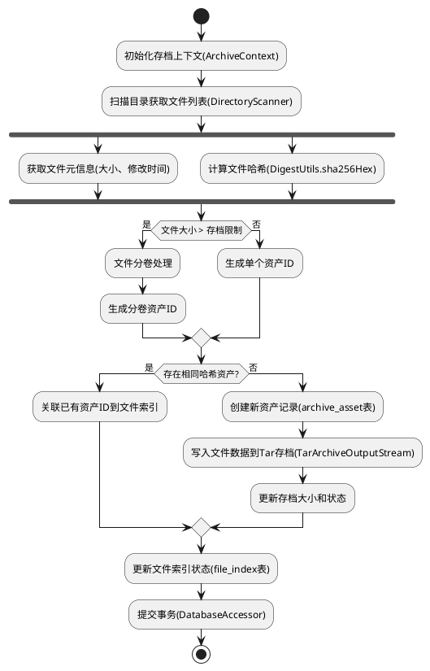
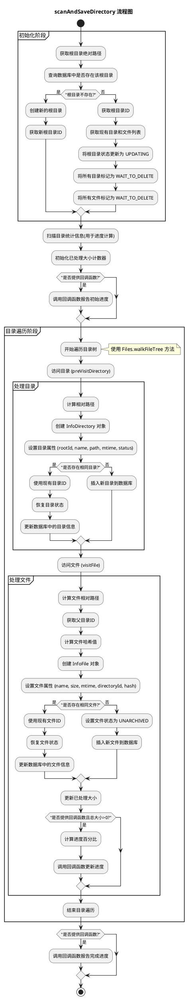

# OneArchive

OneArchive 是一个文件归档系统，旨在帮助用户高效地管理和备份大量文件。

本系统的核心功能是将零散的小文件捆绑为单一文件, 将大体积文件分割为多个卷, 以方便传输与存储.通过自动去重、分卷存储和增量备份等技术，最大化存储效率并确保数据完整性。

## 1. 功能特性

- **智能去重**: 自动识别重复文件，避免重复存储
- **化零为整**: 支持将大量零碎文件归档成单个文件
- **分卷存储**: 自动将大文件分割成指定大小的卷进行存储
- **增量备份**: 只备份发生变化的文件，提高备份效率
- **数据完整性**: 使用SHA-256哈希校验确保文件完整性
- **灵活恢复**: 支持按目录恢复文件
- **数据库管理**: 使用SQLite数据库管理文件索引和元数据

## 2. 安装与使用

### 2.1. 环境要求

- Java 21+
- Maven 3.6+

### 2.2. 构建项目

```bash
bash
mvn clean install
```





## 3. 许可证

- 本项目采用 Apache License 2.0 许可证，详情请见 [LICENSE](LICENSE) 文件。

## 4. 开发计划

### v0.1.0 release

- [ ] 支持软链接/硬链接处理
- [ ] 支持断点续传功能
- [ ] 完善存档或解档中断异常处理机制

### v0.1.1 release

- [ ] API: 支持往指定的根目录指定路径添加指定文件(单一/批量添加)

## 5. 贡献

欢迎提交Issue和Pull Request来改进本项目。

- 本项目 CLA
  详见 [Contributor License Agreement v1 By ZEO](https://gist.github.com/cc01cc/96a194266c6ffbf9f2b8e2c0a5cf97f2)
