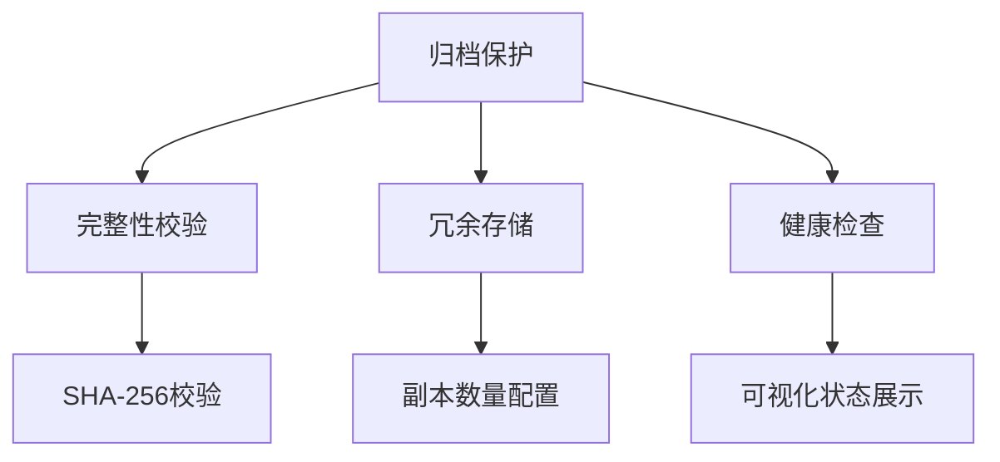

# OneArchive 需求分析文档

## 1. 概述

### 1.1. 项目定位

面向本地用户的开源归档工具，提供高效可靠的文件归档/解档解决方案，支持大文件处理与数据保护，适用于个人数据备份、离线归档等场景。

### 1.2. 目标用户

- 需要本地数据备份的个人用户
- 开发者（支持 API 集成）
- 开源社区贡献者

## 2. 核心功能需求

### 2.1. 归档功能

| 功能点   | 说明                                         |
| -------- | -------------------------------------------- |
| 增量归档 | 仅处理变更文件，支持指定目录/文件过滤        |
| 文件去重 | 基于内容哈希（SHA-256）的智能去重            |
| 分卷存储 | 支持自定义分卷大小（默认 4GB），自动断点续存 |
| 加密支持 | AES-256 加密，支持密码管理器集成             |
| 压缩算法 | 支持 ZIP/7z 格式，可选压缩级别               |

### 2.2. 解档功能

- 多线程解档（支持并发任务数配置）
- 断点续解（自动记录解档进度）
- 选择性提取（支持目录/文件级选择）

### 2.3. 工作区管理

- 修改归档文件路径

### 2.4. 虚拟文件系统

- 树状目录浏览（支持展开/折叠操作，支持平摊操作）
- 文件预览（文本/图片基础预览功能）
- 搜索过滤（支持正则表达式）
- 用户可以在虚拟文件系统中修改归档映射文件，或者选择文件新建一个归档

### 2.5. 数据安全中心

#### 2.5.1. 冗余存储

| 配置项   | 说明                                    |
| -------- | --------------------------------------- |
| 副本数量 | 支持 1-5 份副本配置（默认 2 份）        |
| 存储位置 | 可指定不同物理磁盘/网络路径的冗余存储   |
| 同步策略 | 支持实时同步/定时同步（可配置间隔时间） |
| 修复机制 | 自动检测异常副本并重建                  |

#### 2.5.2. 完整性校验

- 手动触发：提供 CLI 命令和 API 接口触发
- 自动巡检：支持配置巡检周期（每日/每周/每月）
- 校验算法：SHA-256（默认）和 MD5 可选
- 异常处理：自动标记异常归档并记录日志，支持自动修复（当存在有效副本时）

#### 2.5.3. 灾备方案

> 记得数据库文件也要做到快照或者备份

1. 以 archive (例如 *.tar) 为单位进行灾备 (而不是以文件为单位)
2. 不破坏原有的 archive 结构与数据
3. 效果是希望，例如 3 个 archive 文件，丢失了 1 个 archive 文件，仍然可以恢复。

## 3. 非功能需求

### 3.1. 性能要求

- 单文件归档速度 ≥ 50MB/s（SSD环境）
- 内存占用 ≤ 512MB（单任务模式）

### 3.2. 兼容性

- 跨平台支持：Windows 10+ / macOS 11+ / Linux (Ubuntu 20.04+)
- 文件系统支持：NTFS/FAT32/exFAT/ext4

### 3.3. 数据安全

> 自动化保障

## 4. 扩展特性

### 4.1. API 接口

- RESTful API（本地访问）
- 支持归档创建/查询/删除操作

### 4.2. 插件系统

- 提供基础插件模板
- 支持加密算法扩展
- 存储策略插件化

## 5. 运维需求

### 5.1. 存储管理

- 自动清理临时文件（可配置保留周期）
- 存储路径自定义
- 磁盘空间预警（低于 1GB 提示）

### 5.2. 日志系统

- 日志分级（INFO/DEBUG/ERROR）
- 日志轮转（按天/按大小）
