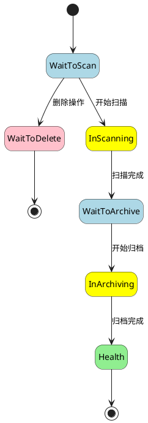
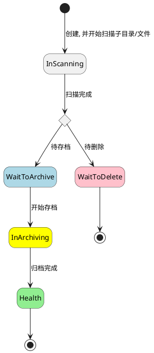
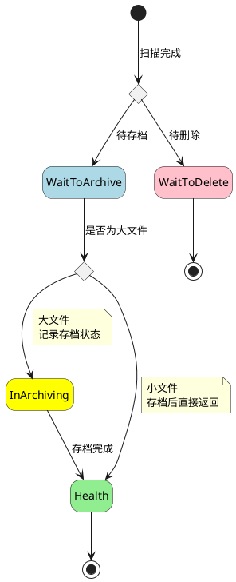

# 详细设计 - 数据记录状态设计

## 1. 状态定义

- 虽然 Root, Directory, File 各个组件目前存在较多名称相同的状态，但各个组件是独立的，各个组件状态不存在强依赖关系
- Root:Health ≠ Directory:Health ≠ File:Health

| 状态                 | 涉及的实体            | 备注                         |
| -------------------- | --------------------- | ---------------------------- |
| WaitToScan           | Root                  | 待扫描                       |
| WaitToArchive        | Root, Directory, File | 待存档                       |
| InScanning           | Root, Directory, File |                              |
| InArchiving          | Root, Directory, File |                              |
| Health               | Root, Directory, File | 健康状态，表示存档完成       |
| ErrorScanningFailed  | Root, Directory, File |                              |
| ErrorArchivingFailed | Root, Directory, File |                              |
| WaitToDelete         | Root                  | 待删除，用户操作删除 Root 时 |
| WaitToDelete         | Directory, File       | 待删除，常见于二次扫描后     |

## 2. 状态转换

- File, Directory 和 Root 的状态是相互独立的，三者状态转换是一个原子操作，即可理解为是并行的
- Directory, File 扫描后存在 `有更新`, `无更新, 已存档`, `无更新, 但之前没有存档成功` 三种状态, 对应的会有两个状态 `HEALTTH`, `WaitToArchive`, 但是实际上可以继续简化为仅保留 `WaitToArchive` 状态:
  - 因为 `WaitToArchive` 状态, 会进入到存档流程, 存档中, 重复文件也不会重复存储, 所以并不会有太多性能消耗
  - 同时, 减少分支状态, 可以大幅优化逻辑与流程

### 2.1. Root 状态转换示意图

不包含异常状态

### 2.2. Directory 状态转换示意图

不包含异常状态

### 2.3. File 状态转换示意图

不包含异常状态

