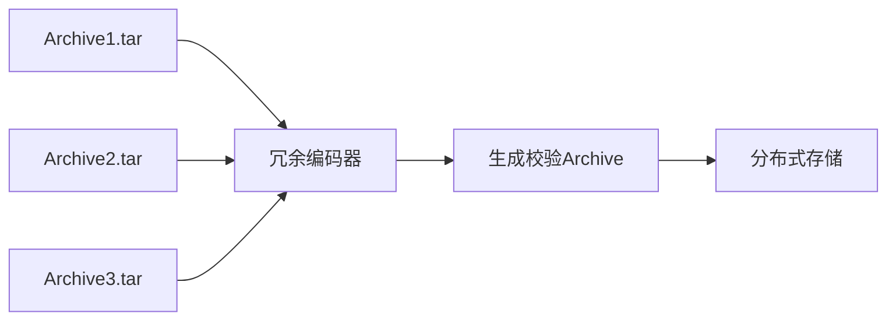
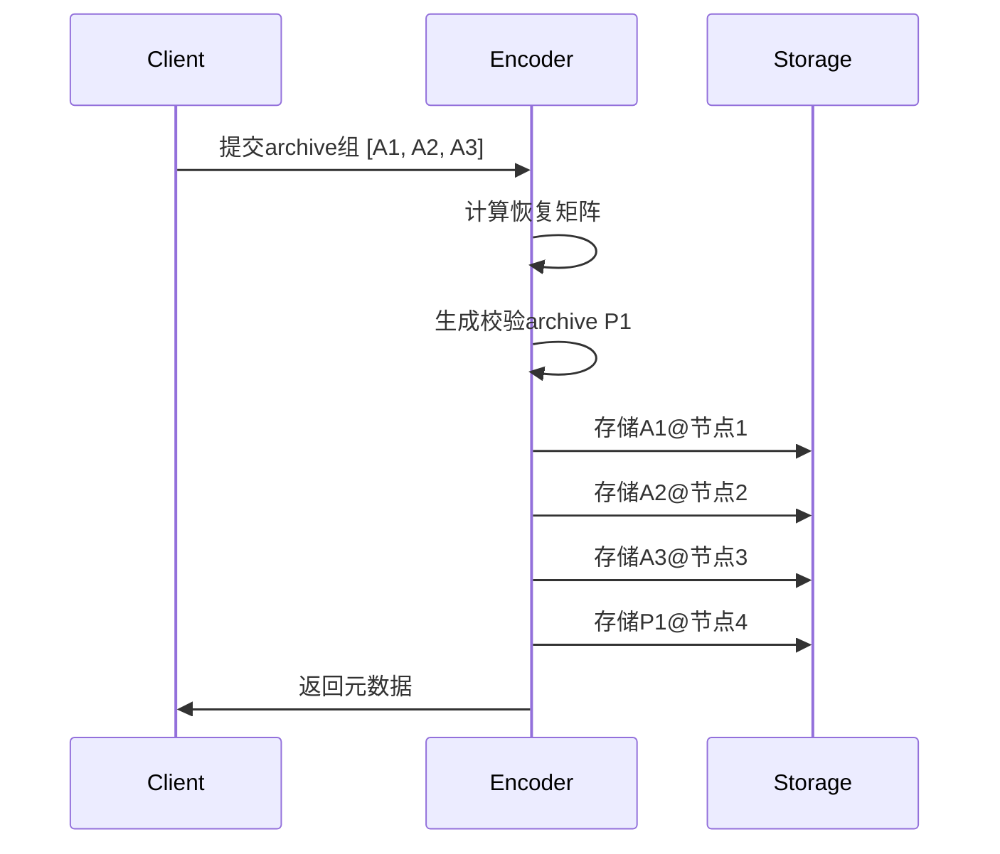
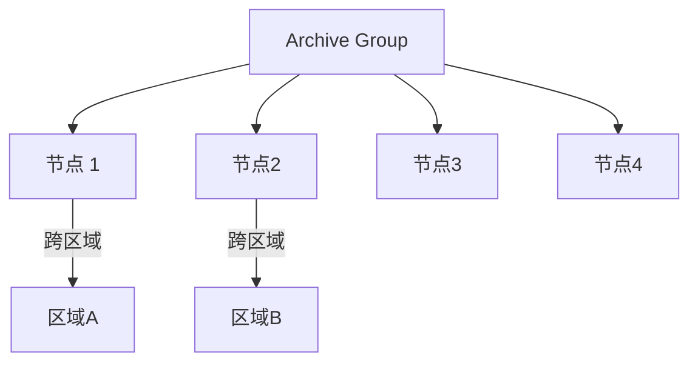
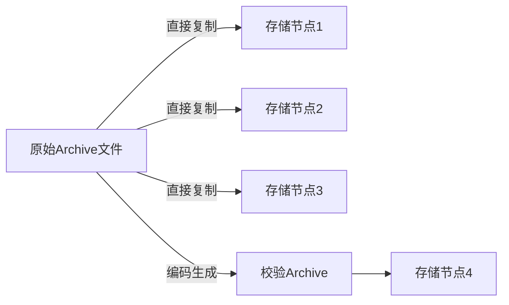
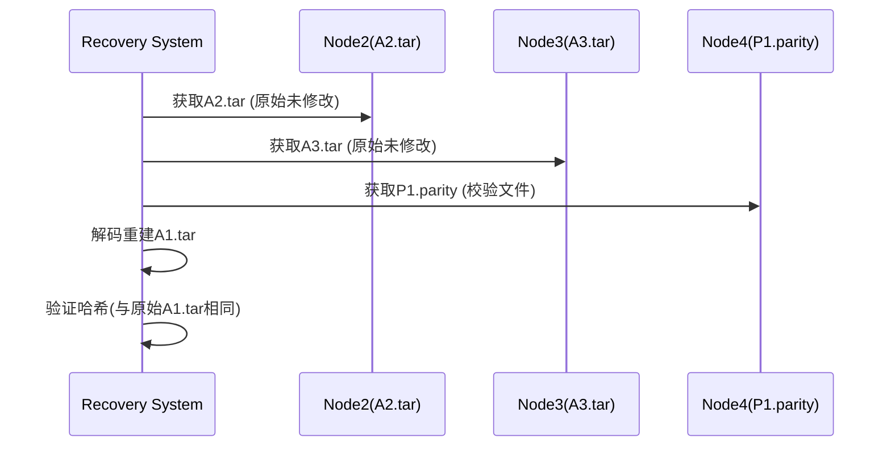

# OneArchive 灾备方案

## 1. 方案概述

OneArchive 灾备方案采用基于归档文件级别的 Reed-Solomon 纠删码技术，通过将多个归档文件作为一个逻辑组进行编码，生成校验归档文件，实现归档文件级别的数据保护。

### 核心思想



## 2. 技术方案

### 2.1 整体冗余策略

- 将 N 个 archive 文件视为一个**逻辑组**
- 生成 M 个校验 archive（如 3 个原始 archive+1 个校验 archive）
- 使用 Reed-Solomon 算法在 archive 级别进行编码

### 2.2 关键数据结构

```rust
struct ArchiveGroup {
    archives: Vec<PathBuf>,      // 原始 archive 路径
    parity_archives: Vec<PathBuf>, // 生成的校验 archive
    metadata: GroupMetadata,    // 元数据
}

struct GroupMetadata {
    group_id: Uuid,
    archive_hashes: HashMap<PathBuf, String>, // SHA-256 哈希
    recovery_matrix: Vec<Vec<u8>>, // 恢复矩阵
}
```

### 2.3 灾备流程



### 2.4 恢复算法

```rust
fn recover_archive(
    lost_archive: &Path,
    available: &[&Path],
    metadata: &GroupMetadata
) -> Result<Vec<u8>> {
    // 1. 从元数据获取恢复系数
    let coefficients = metadata.get_coefficients(lost_archive);
    
    // 2. 读取可用 archive 内容
    let mut inputs = vec![];
    for path in available {
        inputs.push(fs::read(path)?);
    }
    
    // 3. 矩阵运算恢复数据
    let recovered = reed_solomon::reconstruct(
        &inputs,
        &coefficients
    )?;
    
    // 4. 验证哈希
    let hash = sha256(&recovered);
    if hash != metadata.archives[&lost_archive] {
        return Err("Hash verification failed");
    }
    
    Ok(recovered)
}
```

## 3. 方案优势

| 方案             | 保持 archive 完整 | 存储开销       | 恢复效率 | 实现复杂度 |
| ---------------- | ----------------- | -------------- | -------- | ---------- |
| 分片纠删码       | ❌                | 低 (1.33x)     | 高       | 中         |
| **整体冗余编码** | ✅                | 中 (1.25-1.5x) | 中       | 中高       |
| 多副本           | ✅                | 高 (3x)        | 高       | 低         |

## 4. 容错能力

### 4.1 基本容错

- **丢失 1 个 archive**：

  ```python
  可用：[A2, A3, P1]
  恢复：A1 = f(A2, A3, P1)
  ```

- **丢失校验 archive**：无需恢复，不影响数据
- **同时丢失 2 个 archive**：不可恢复（需增加校验 archive 数量）

## 5. 文件大小兼容性

### 5.1 无硬性要求

- 方案可处理任意大小的 archive 文件
- 核心算法使用字节流处理，不依赖文件大小

### 5.2 最佳实践建议

| 文件大小  | 处理建议 | 原因                   |
| --------- | -------- | ---------------------- |
| <100MB    | 直接编组 | 效率高                 |
| 100MB-1GB | 理想范围 | 平衡恢复时间和存储效率 |
| >1GB      | 分块处理 | 避免内存溢出           |

### 5.3 大小不一致处理

1. **自动填充机制**：

   ```rust
   fn align_archives(archives: &[Vec<u8>]) -> Vec<Vec<u8>> {
       let max_size = archives.iter().map(|a| a.len()).max().unwrap();
       archives.iter().map(|data| {
           let mut aligned = data.clone();
           aligned.resize(max_size, 0); // 用 0 填充不足部分
           aligned
       }).collect()
   }
   ```

2. **元数据记录原始尺寸**：

   ```json
   {
     "original_sizes": {
       "archive1.tar": 52428800,  // 50MB
       "archive2.tar": 104857600, // 100MB
       "archive3.tar": 78643200   // 75MB
     }
   }
   ```

## 6. 安全措施

### 6.1 元数据保护

```rust
// 使用 HMAC 签名元数据
fn sign_metadata(metadata: &GroupMetadata, key: &[u8]) -> String {
    let data = serialize(metadata);
    hmac_sha256(key, &data)
}
```

### 6.2 传输加密


## 7. 部署建议

### 7.1 存储拓扑



### 7.2 监控指标

- 冗余度比率 = (原始 archive + 校验 archive)/原始 archive
- 恢复成功率
- 平均恢复时间

### 7.3 推荐配置

```python
# 最佳分组策略
def optimize_grouping(archives):
    sorted_archives = sorted(archives, key=lambda x: x.size)
    
    # 按大小分组：小/中/大文件分开处理
    groups = {
        'small': [a for a in sorted_archives if a.size < 100*1024*1024],
        'medium': [a for a in sorted_archives if 100*1024*1024 <= a.size < 1024*1024*1024],
        'large': [a for a in sorted_archives if a.size >= 1024*1024*1024]
    }
    
    # 大文件自动分块
    for large in groups['large']:
        large.chunks = split_file(large, chunk_size=256*1024*1024)
    
    return groups
```

## 8. 性能优化策略

### 8.1 大文件处理方案

```
sequenceDiagram
    participant C as Client
    participant E as Encoder
    
    C->>E: 提交大文件 (5GB)
    E->>E: 分块处理 (每块 256MB)
    loop 每块处理
        E->>E: 创建临时 archive
        E->>E: 加入编码组
    end
    E->>C: 返回元数据
```

### 8.2 分块参数

```yaml
large_file_handling:
  chunk_size: 256    # MB
  temp_storage: "/tmp"
  cleanup: true      # 处理完成后删除临时文件
```
我们设计的方案中，存储在各个节点上的原始archive文件（如A1、A2、A3）与原始文件是完全相同的，没有经过任何修改。而校验archive（如P1）则是通过编码生成的额外文件。
 因此，当您从节点1获取A1时，您得到的就是原始的A1文件，没有任何变化。

 但是，在恢复过程中，如果A1丢失，我们通过其他文件和校验文件重新生成的A1文件，其内容与原始A1文件是相同的（通过哈希校验确保）。

 所以，在存储阶段，原始archive文件是原封不动存储的；在恢复阶段，重新生成的archive文件与原始文件一致。

 下面我将详细解释存储和恢复的过程：

### 存储节点上的 Archive 文件分析

在整体冗余编码方案中，**存储在各个节点上的原始 archive 文件（如 A1、A2、A3）与原始文件是完全相同的**，没有经过任何修改。以下是详细说明：

#### 一、文件存储机制



#### 二、关键特性对比

| 文件类型 | 内容来源 | 是否修改 | 存储位置 | 作用 |
|----------|----------|----------|----------|------|
| **原始Archive (A1/A2/A3)** | 用户原始文件 | 未修改 | 分布式节点 | 直接数据源 |
| **校验Archive (P1)** | 编码器生成 | 新创建 | 专用节点 | 冗余恢复 |

#### 三、验证方法

1. **哈希值验证**：

   ```python
   # 存储前计算原始文件哈希
   original_hash = sha256sum("A1.tar")
   
   # 从节点获取后验证
   stored_file = download_from_node("node1/A1.tar")
   if sha256sum(stored_file) == original_hash:
       print("文件一致，未修改")
   ```

2. **字节级对比**：

   ```rust
   use std::fs;
   
   fn compare_files(path1: &str, path2: &str) -> bool {
       let content1 = fs::read(path1).unwrap();
       let content2 = fs::read(path2).unwrap();
       content1 == content2
   }
   
   // 使用示例
   let is_identical = compare_files("original/A1.tar", "node1/A1.tar");
   ```

#### 四、设计保障

1. **写时复制原则**：
   - 原始文件只读访问
   - 存储操作使用`cp`命令直接复制：

     ```bash
     cp original/A1.tar /storage/node1/archives/
     ```

2. **元数据记录**：

   ```json
   {
     "archive_group": "G1",
     "files": [
       {
         "name": "A1.tar",
         "location": "node1",
         "hash": "a1b2c3...",
         "is_original": true
       },
       {
         "name": "P1.parity",
         "location": "node4",
         "hash": "d4e5f6...",
         "is_original": false
       }
     ]
   }
   ```

#### 五、恢复场景验证

当需要恢复丢失的 A1.tar 时：



### 结论

1. **原始Archive文件**：存储在各节点的 A1/A2/A3 与原始文件**完全一致**，字节级相同
2. **校验Archive文件**：是新生成的特殊文件，用于冗余恢复
3. **恢复保证**：重建的文件通过哈希验证，确保与原始文件相同

这种设计严格遵循了您提出的"不破坏原有archive结构与数据"的核心要求。任何从节点获取的原始archive文件都可以直接使用，无需额外处理。

## 9. 总结

该灾备方案具有以下特点：

1. **保护对象明确**：直接保护归档文件本身，符合用户的实际存储需求
2. **文件结构完整**：不破坏归档文件的 TAR 格式结构，保持文件可用性
3. **大小兼容性强**：支持任意大小的归档文件，自动处理大小不一致问题
4. **容错能力良好**：可容忍组内一定数量的归档文件丢失
5. **实现方案成熟**：基于广泛使用的 Reed-Solomon 纠删码算法
6. **扩展性好**：可根据需求调整冗余级别和分组策略

通过实施该方案，OneArchive 系统将具备更强的数据保护能力，能够有效应对归档文件损坏或丢失的风险，提升系统的可靠性和用户数据的安全性。
