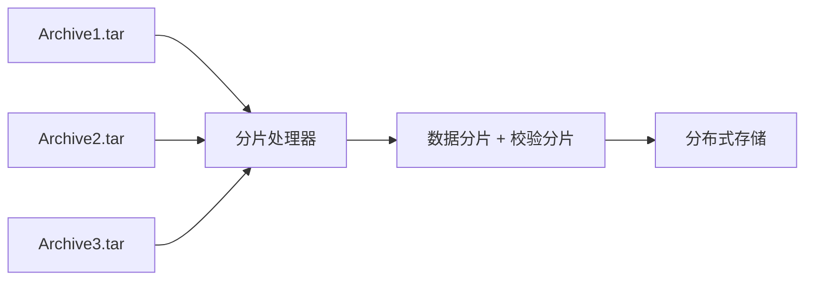
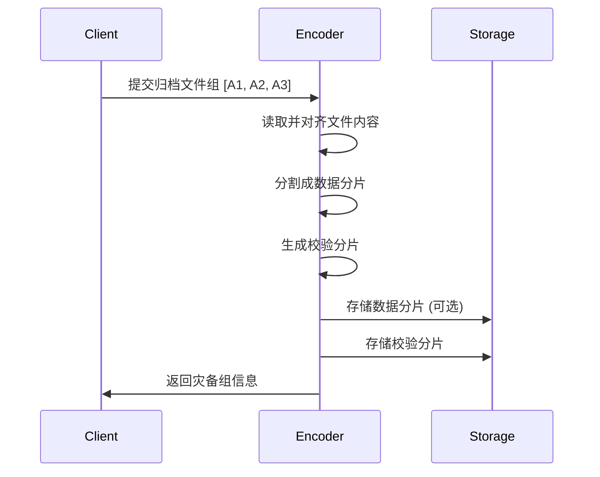
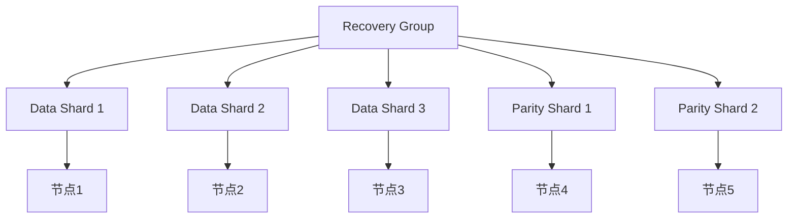
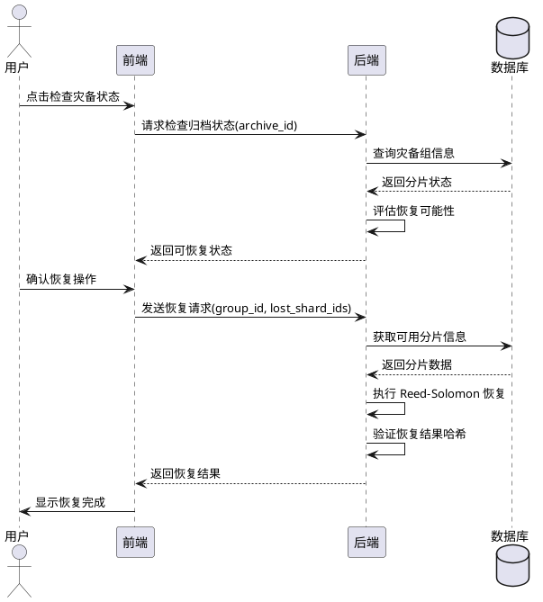

# OneArchive 灾备方案设计

## 1. 需求分析

该灾备方案具有以下特点：

1. **保护对象明确**：直接保护归档文件本身，符合用户的实际存储需求
2. **文件结构完整**：不破坏归档文件的 TAR 格式结构，保持文件可用性
3. **大小兼容性强**：支持任意大小的归档文件，自动处理大小不一致问题
4. **容错能力良好**：可容忍组内一定数量的分片丢失
5. **实现方案成熟**：基于广泛使用的 Reed-Solomon 纠删码算法
6. **扩展性好**：可根据需求调整冗余级别和分组策略

## 2. 方案概述

OneArchive 灾备方案采用基于分片的 Reed-Solomon 纠删码技术，通过将归档文件分割成数据分片和校验分片，实现归档文件级别的数据保护。系统将多个归档文件组织成灾备组，进行分布式编码和存储。

### 2.1. 核心思想



## 3. 核心概念

### 3.1. 灾备组 (Recovery Group)

灾备组是多个归档文件的逻辑集合，作为编码和恢复的基本单位。每个灾备组包含：

- **数据分片数量**：原始归档文件被分割成的分片数
- **校验分片数量**：用于恢复的冗余分片数
- **分片大小**：每个分片的固定大小

### 3.2. 分片类型

#### 3.2.1. 数据分片 (Data Shard)

- 从原始归档文件分割得到
- 直接来源于用户数据
- 可选择是否存储（根据配置决定）

#### 3.2.2. 校验分片 (Parity Shard)

- 通过 Reed-Solomon 算法编码生成
- 用于数据恢复的冗余信息
- 始终存储在系统中

## 4. 技术方案

### 4.1. 数据结构

```rust
/// 灾备组信息
pub struct RecoveryGroupInfo {
    pub group_id: i64,
    pub data_shards_stored: bool,  // 是否存储数据分片
    pub num_data_shards: u64,      // 数据分片数量
    pub num_parity_shards: u64,    // 校验分片数量
    pub shard_size: u64,           // 分片大小
}

/// 数据分片
pub struct RecoveryDataShard {
    pub id: i64,
    pub group_id: i64,
    pub shard_index: i64,
    pub shard_path: Option<String>,  // 可选存储路径
    pub shard_hash: String,          // SHA-256 哈希
    pub status: RecoveryDataShardStatus,
}

/// 校验分片
pub struct RecoveryParityShard {
    pub id: i64,
    pub group_id: i64,
    pub shard_index: i64,
    pub shard_path: String,  // 必须有存储路径
    pub shard_hash: String,  // SHA-256 哈希
    pub status: RecoveryParityShardStatus,
}
```

### 4.2. 编码流程



### 4.3. 恢复算法

```rust
fn recover_lost_shards(
    available_shards: &[Vec<u8>],
    shard_indices: &[usize],
    reed_solomon: &ReedSolomon
) -> Result<Vec<Vec<u8>>> {
    // 1. 准备恢复矩阵
    let mut shards = vec![None; reed_solomon.total_shards()];
    for (i, shard) in available_shards.iter().enumerate() {
        shards[shard_indices[i]] = Some(shard.clone());
    }

    // 2. 执行 Reed-Solomon 恢复
    reed_solomon.reconstruct(&mut shards)?;

    // 3. 提取恢复的分片
    let recovered: Vec<Vec<u8>> = shards.into_iter()
        .filter_map(|s| s)
        .collect();

    Ok(recovered)
}
```

## 5. 容错能力

### 5.1. 基本容错

- **丢失数据分片**：可通过校验分片恢复，只要可用分片总数 ≥ 数据分片数
- **丢失校验分片**：不影响数据访问，可通过剩余校验分片恢复
- **恢复条件**：可用分片数 ≥ 数据分片数

### 5.2. 容错示例

以 3 数据分片 + 2 校验分片为例：

| 丢失情况          | 是否可恢复 | 说明                      |
| ----------------- | ---------- | ------------------------- |
| 丢失 1 个数据分片 | Y          | 使用 2 数据 + 2 校验恢复  |
| 丢失 2 个数据分片 | Y          | 使用 1 数据 + 2 校验恢复  |
| 丢失 1 个校验分片 | Y          | 使用 3 数据 + 1 校验恢复  |
| 丢失 3 个数据分片 | N          | 超过恢复能力              |

## 6. 文件处理策略

### 6.1. 分片对齐

对于大小不一致的归档文件，系统使用填充机制确保分片对齐：

```rust
fn align_file_data(data: &[u8], shard_size: usize) -> Vec<u8> {
    let mut aligned = data.to_vec();
    // 填充到分片大小的整数倍
    let padding = (shard_size - (data.len() % shard_size)) % shard_size;
    aligned.extend(vec![0u8; padding]);
    aligned
}
```

### 6.2. 大文件处理

TODO

对于大文件，计划支持分块处理策略; 目前可以通过限制 limit_archive_size 参数来限制体积。

## 7. 安全措施

### 7.1. 数据完整性验证

```rust
// SHA-256 哈希验证
fn verify_shard_integrity(shard_data: &[u8], expected_hash: &str) -> bool {
    let actual_hash = sha256::digest(shard_data);
    actual_hash == expected_hash
}
```

## 8. 部署建议

### 8.1. 存储拓扑



### 8.2. 配置建议

```rust
// 推荐配置
pub struct RecoveryConfig {
    pub data_shards: usize = 3,      // 数据分片数
    pub parity_shards: usize = 2,    // 校验分片数
    pub shard_size: u64 = 64 * 1024 * 1024, // 64MB 分片大小
    pub store_data_shards: bool = true,     // 存储数据分片
}
```

## 9. 监控和优化

### 9.1. 监控指标

- **冗余度比率** = (数据分片 + 校验分片) / 数据分片
- **恢复成功率**：恢复操作的成功率统计
- **平均恢复时间**：从检测到恢复完成的时间
- **存储效率**：实际存储大小 / 原始数据大小

### 9.2. 性能优化

- **内存管理**：分片处理时控制内存使用，避免大文件导致 OOM
- **并发处理**：支持多线程编码和恢复操作
- **缓存策略**：缓存常用分片，减少磁盘 I/O

## 10. 恢复流程

### 10.1. 恢复触发条件

灾备恢复在以下情况下触发：

1. 用户手动检查发现归档文件异常
2. 系统定期巡检检测到分片丢失
3. 存储节点故障导致分片不可访问

### 10.2. 恢复时序图


