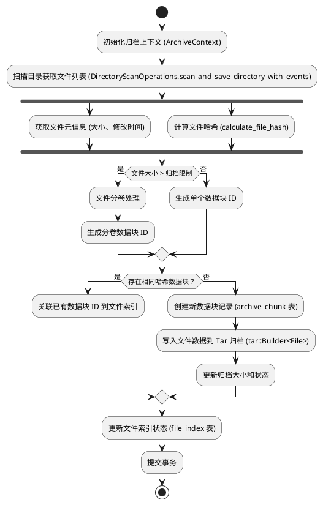
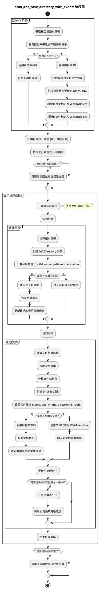

# 快速开始

OneArchive 是一个文件归档系统，旨在帮助用户高效地管理和备份大量文件。

本系统的核心功能是将零散的小文件捆绑为单一文件，将大体积文件分割为多个卷，以方便传输与存储。通过自动去重、分卷存储和增量备份等技术，最大化存储效率并确保数据完整性。

## 系统要求

- Windows 10/11, macOS 10.15+, 或 Linux (Ubuntu 20.04+)
- Node.js 16+
- Rust 工具链

## 安装

```bash
# 克隆仓库
git clone https://github.com/cc01cc/OneArchive.git

cd OneArchive/tauri

# 安装依赖
pnpm install

# 运行开发版本
pnpm run tauri dev
```

## 功能特性

### 核心功能

- **智能去重**: 自动识别重复文件，避免重复存储
- **化零为整**: 支持将大量零碎文件归档成单个文件
- **分卷存储**: 自动将大文件分割成指定大小的卷进行存储
- **增量备份**: 只备份发生变化的文件，提高备份效率
- **数据完整性**: 使用 SHA-256 哈希校验确保文件完整性
- **灵活恢复**: 支持按目录恢复文件
- **数据库管理**: 使用 SQLite 数据库管理文件索引和元数据

### 灾备功能

- **容灾备份**: 生成冗余恢复数据，即使丢失部分分卷也能完整恢复原始文件
- **Reed-Solomon 纠删码**: 采用先进的纠删码技术保障数据安全
- **灵活配置**: 支持自定义数据分片和校验分片数量

## 架构设计

### 归档流程



### 目录扫描流程



## 项目结构

```txt
OneArchive/
├── tauri/                  # Tauri 应用主目录
│   ├── src/                # 前端源码 (Vue 3 + TypeScript)
│   │   ├── api/            # Tauri 命令调用封装
│   │   ├── components/     # Vue 组件
│   │   │   ├── recovery/   # 灾备相关组件
│   │   ├── composables/    # Vue 组合式函数
│   │   ├── layouts/        # 页面布局
│   │   ├── pages/          # 页面组件
│   │   │   ├── task-center/# 任务中心页面
│   │   ├── router/         # 路由配置
│   │   ├── store/          # Pinia 状态管理
│   │   ├── types/          # TypeScript 类型定义
│   │   └── assets/         # 静态资源
│   └── src-tauri/          # Rust 后端源码
│       ├── src/
│       │   ├── mod_archive/      # 归档模块
│       │   │   ├── trait_archive.rs    # 归档 trait 定义
│       │   │   ├── impl_archive.rs     # 归档具体实现
│       │   │   ├── utils_archive.rs    # 归档工具函数
│       │   ├── mod_database/     # 数据库模块
│       │   │   ├── trait_database.rs   # 数据库 trait
│       │   │   ├── impl_database.rs    # 数据库实现
│       │   │   ├── schema.rs           # 数据模型
│       │   │   ├── constants.rs        # 数据库常量
│       │   │   ├── dao_database/       # DAO 层
│       │   ├── mod_scan/         # 扫描模块
│       │   │   ├── trait_scan.rs       # 扫描 trait
│       │   │   ├── impl_scan.rs        # 扫描实现
│       │   │   ├── model_scan.rs       # 扫描模型
│       │   ├── mod_extract/      # 解压模块
│       │   ├── mod_disaster_recovery/  # 灾备模块
│       │   ├── api.rs            # Tauri API 接口
│       │   ├── main.rs           # 程序入口
│       │   ├── lib.rs            # 库入口
│       │   └── utils.rs          # 工具函数
│       ├── Cargo.toml         # Rust 依赖配置
│       ├── tauri.conf.json    # Tauri 配置
│       └── icons/             # 应用图标
├── docs/                   # 项目文档
│   ├── .vitepress/         # VitePress 配置
│   ├── guide/              # 指南文档
│   └── public/             # 文档静态资源
├── assets/                 # 项目资源
├── package.json            # Node.js 依赖配置
├── pnpm-lock.yaml          # pnpm 锁文件
├── README.md               # 项目说明
├── LICENSE                 # 许可证
└── .gitignore              # Git 忽略文件
```

## 开发计划

### v0.1.0 release

- [ ] 支持软链接/硬链接处理
- [ ] 支持断点续传功能
- [ ] 完善归档或解档中断异常处理机制

### v0.1.1 release

- [ ] API: 支持往指定的根目录指定路径添加指定文件 (单一/批量添加)

## 许可证

本项目采用 Apache License 2.0 许可证，详情请见 [LICENSE](https://github.com/cc01cc/OneArchive/blob/main/LICENSE) 文件。

## 贡献

欢迎提交 Issue 和 Pull Request 来改进本项目。

本项目使用贡献者许可协议 (CLA)，详见 [Contributor License Agreement v1 By ZEO](https://gist.github.com/cc01cc/96a194266c6ffbf9f2b8e2c0a5cf97f2)
