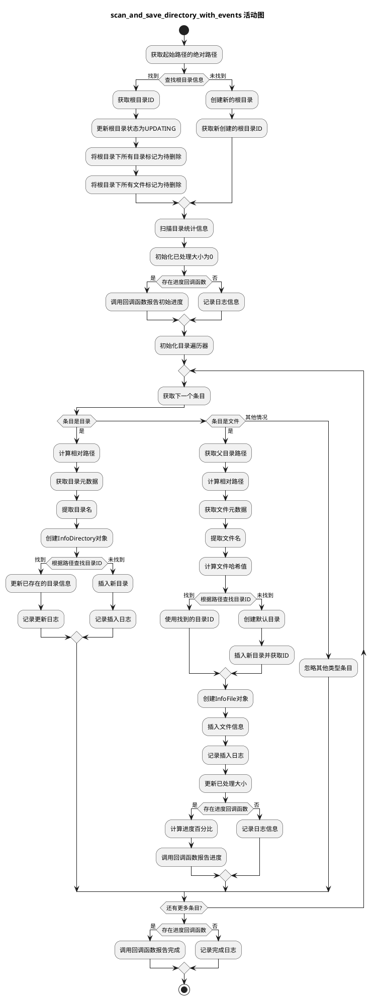
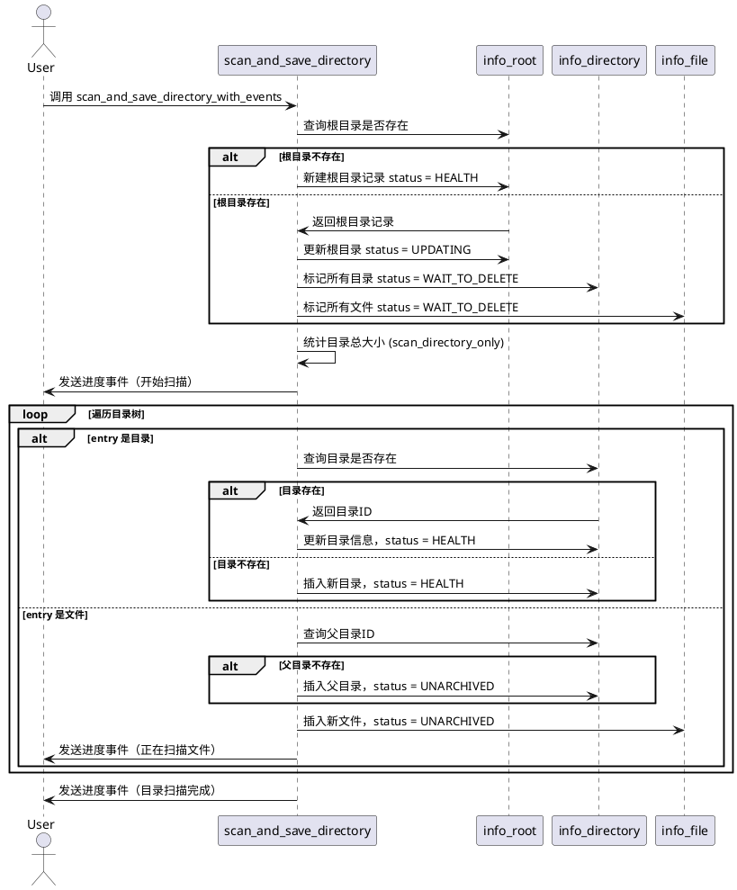

```plantuml
@startuml
title scan_and_save_directory_with_events 活动图

start

:获取起始路径的绝对路径;

if (查找根目录信息) then (找到)
    :获取根目录ID;
    :更新根目录状态为UPDATING;
    :将根目录下所有目录标记为待删除;
    :将根目录下所有文件标记为待删除;
else (未找到)
    :创建新的根目录;
    :获取新创建的根目录ID;
endif

:扫描目录统计信息;
:初始化已处理大小为0;

if (存在进度回调函数) then (是)
    :调用回调函数报告初始进度;
else (否)
    :记录日志信息;
endif

:初始化目录遍历器;

repeat
    :获取下一个条目;
    
    if (条目是目录) then (是)
        :计算相对路径;
        :获取目录元数据;
        :提取目录名;
        :创建InfoDirectory对象;
        
        if (根据路径查找目录ID) then (找到)
            :更新已存在的目录信息;
            :记录更新日志;
        else (未找到)
            :插入新目录;
            :记录插入日志;
        endif
        
    else if (条目是文件) then (是)
        :获取父目录路径;
        :计算相对路径;
        :获取文件元数据;
        :提取文件名;
        :计算文件哈希值;
        
        if (根据路径查找目录ID) then (找到)
            :使用找到的目录ID;
        else (未找到)
            :创建默认目录;
            :插入新目录并获取ID;
        endif
        
        :创建InfoFile对象;
        :插入文件信息;
        :记录插入日志;
        
        :更新已处理大小;
        if (存在进度回调函数) then (是)
            :计算进度百分比;
            :调用回调函数报告进度;
        else (否)
            :记录日志信息;
        endif
    else (其他情况)
        :忽略其他类型条目;
    endif
    
repeat while (还有更多条目?)

if (存在进度回调函数) then (是)
    :调用回调函数报告完成;
else (否)
    :记录完成日志;
endif

stop

@enduml
```

```plantuml
@startuml
actor User
participant "scan_and_save_directory" as Service
participant "info_root" as Root
participant "info_directory" as Dir
participant "info_file" as File

User -> Service: 调用 scan_and_save_directory_with_events

Service -> Root: 查询根目录是否存在
alt 根目录不存在
    Service -> Root: 新建根目录记录 status = HEALTH
else 根目录存在
    Root -> Service: 返回根目录记录
    Service -> Root: 更新根目录 status = UPDATING
    Service -> Dir: 标记所有目录 status = WAIT_TO_DELETE
    Service -> File: 标记所有文件 status = WAIT_TO_DELETE
end

Service -> Service: 统计目录总大小 (scan_directory_only)
Service -> User: 发送进度事件（开始扫描）

loop 遍历目录树
    alt entry 是目录
        Service -> Dir: 查询目录是否存在
        alt 目录存在
            Dir -> Service: 返回目录ID
            Service -> Dir: 更新目录信息，status = HEALTH
        else 目录不存在
            Service -> Dir: 插入新目录，status = HEALTH
        end
    else entry 是文件
        Service -> Dir: 查询父目录ID
        alt 父目录不存在
            Service -> Dir: 插入父目录，status = UNARCHIVED
        end
        Service -> File: 插入新文件，status = UNARCHIVED
        Service -> User: 发送进度事件（正在扫描文件）
    end
end

Service -> User: 发送进度事件（目录扫描完成）
@enduml
```

